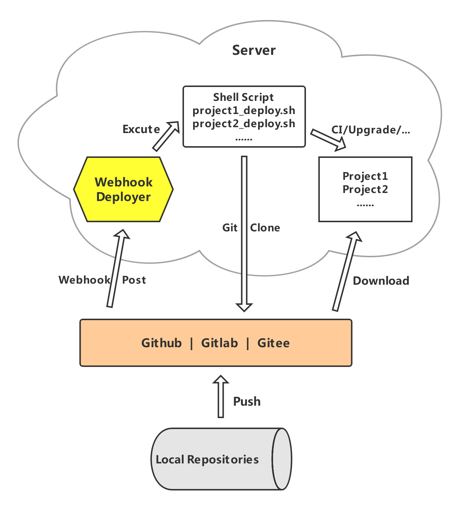

# Webhook Deployer

基于 github|gitlab|gitee 的 webhook 机制实现的服务器自动部署程序。

原理是在 github 项目的 `webhook` 设置处添加本程序服务地址作为钩子，当 github 有 push 等动作时，会 POST 请求本服务接口，程序会自动校验合法请求并执行配置的 shell 文件，由 shell 文件进行项目部署的一系列处理，因此本程序支持 nodejs、java、php 等任何能通过 shell 自动部署的项目，如下图：



本程序采用 [nodejs](https://nodejs.org/zh-cn/) 语言基于 [egg.js](https://eggjs.org/zh-cn/) 框架开发实现，服务器需安装 Node 9+ 版本。


## Configuration

程序配置文件 `conf/config.json` 说明

* dingtalkRobot - 钉钉机器人配置（可选）
  * enable - 是否启动，true-启用，false-停用(默认)
  * accessToken - 机器人 token
  * startTemplate - 开始部署时消息通知模板，仅支持模板变量 `#REPONSITORY_NAME#` ，表示仓库名
  * endTemplate - 部署完成时消息消息模板，仅支持模板变量 `#REPONSITORY_NAME#` ，表示仓库名
* secretToken - 在 webhook 设置的全局密钥（可选）
* github - 项目在 github 仓库的配置，每个项目一个独立的属性 `key` ，到时需配置在 webhook 地址上
  * event - 指定何种事件才触发，默认 push，注意 github 和 gitlab 对应的事件名不一致
  * secret - 在 webhook 设置的密钥，如不配置则引用 `secretToken` 全局密钥
  * cmdFile - 部署时需要自动执行的 shell 文件，用绝对全路径
  * args - 传递给 shell 文件的固定参数，可在 shell 中用 $2、$3 ... 方式获取
* gitlab - 项目在 gitlab 仓库的配置，同 `github`
* gitee - 项目在 gitee 码云仓库的配置，同 `github`


## Step 1

在服务器指定目录下拉取本仓库代码

```bash
$ git clone -b master https://github.com/schwanncheung/webhook-deployer.git webhook-deployer
```

### Step 2

进入 `webhook-deployer` 目录，安装依赖

```bash
$ cd webhook-deployer
$ npm install
```

## Step 3

配置需要自动部署的项目，在 `webhook-deployer` 根目录下创建 `conf` 目录，然后在该目录创建 `config.json` 配置文件。

```bash
$ mkdir conf
$ touch conf/config.json
$ vi conf/config.json
```

配置文件说明见 `Configuration`, 示例：

```json
{
  "dingtalkRobot": {
    "enable": true,
    "accessToken": "xxxxxxxxxxxxx",
    "startTemplate": "开始部署 #REPONSITORY_NAME# ...",
    "endTemplate": "#REPONSITORY_NAME# 部署完成."
  },
  "secretToken": "xxxxxxxxxxxxxxxxx",
  "github": {
    "project1": {
      "secret": "xxxxx",
      "cmdFile": "/scripts/project1_deploy.sh"
    }
  },
  "gitlab": {
    "project2": {
      "event": "push hook",
      "cmdFile": "/scripts/project2_deploy.sh",
      "args": [ "release", "argument 2" ]
    }
  },
  "gitee": {
  }
}
```

## Step 4

创建上面配置文件中 `cmdFile` 指定的 shell 脚本文件，根据每个项目的实际需要创建脚本。

```bash
#/bin/bash 

git clone -b $2 git@gitlab.com:xxxx/project2.git project2
cd project2
npm install --production
# 各种打包处理逻辑...

```

## Step 5

启动服务，在 `webhook-deployer` 目录下执行以下脚本，它会占用 `7777` 端口启动。

```bash
$ npm run start
```

此时，http://你的服务器IP:7777/ 应该已经正常启动了，如果不想直接使用 IP，比如域名 `webhook.xxx.com`, 可以用 nginx 做反向代理指向 `http://127.0.0:7777` 即可。


## Step 6

* github 项目，在 Settings 中，找到 Webhooks，添加 Webhook，URL 填写 `http://webhook.xxx.com/github?key=project1` (其中 key 为配置上面配置文件中对应键值)，ContentType 选择 `application/json`，填上 secret 保存。
* gitlab 项目，在 Settings 中，找到 Integrations，添加 Webhook，URL 填写 `http://webhook.xxx.com/gitlab?key=project2` (其中 key 为配置上面配置文件中对应键值)，填上 secret，选择 Push events 保存。
* gitee 项目，在 管理 中，找到 Webhooks，添加 Webhook，URL 填写 `http://webhook.xxx.com/gitee?key=project3` (其中 key 为配置上面配置文件中对应键值)，密码填上 secret，选择 Push 事件保存。

经过以上配置，可以尝试提交代码进行自动化部署了。

## Other

如果需要停止本程序服务，直接在 `webhook-deployer` 目录下执行：

```bash
$ npm run stop
```

## License

MIT


## Donate

开源不易，如有帮助，就打赏一杯82年的咖啡给作者压压惊吧~

|  |  |
|----|----|
